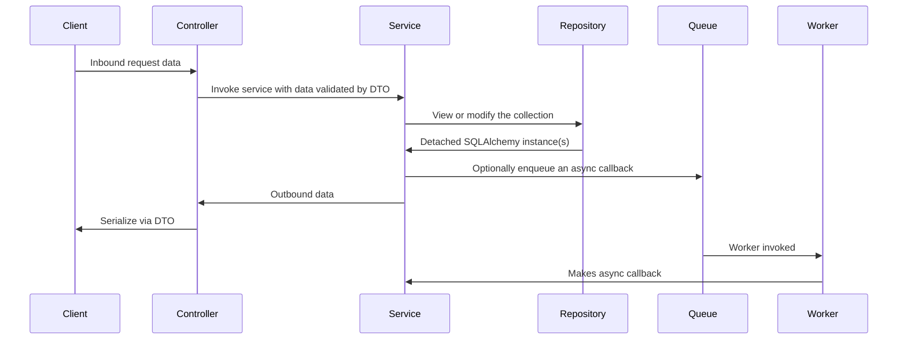

# starlite-saqlalchemy

Starlite, SQLAlchemy 2.0 and SAQ configuration plugin.

## Pattern

This is the pattern that this application encourages.



- Request data is deserialized and validated by Starlite before it is received by controller.
- Controller invokes relevant service object method and waits for response.
- Service method handles business logic of the request and optionally triggers an asynchronous
  callback.
- Service method returns to controller and response is made to client.
- Async worker makes callback to service object where any async tasks can be performed.
  Depending on architecture, this may not be the same instance of the application that handled the
  request.

## Usage Example

```py title="Simple Example"
--8<-- "examples/basic_example.py"
```

Configuration via environment.

```dotenv title="Example .env"
--8<-- ".env.example"
```
